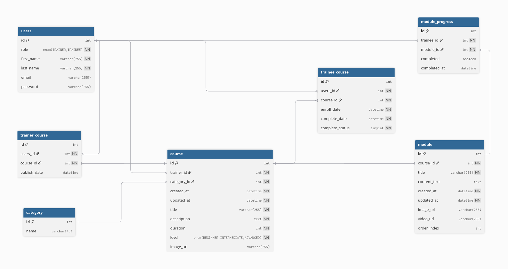
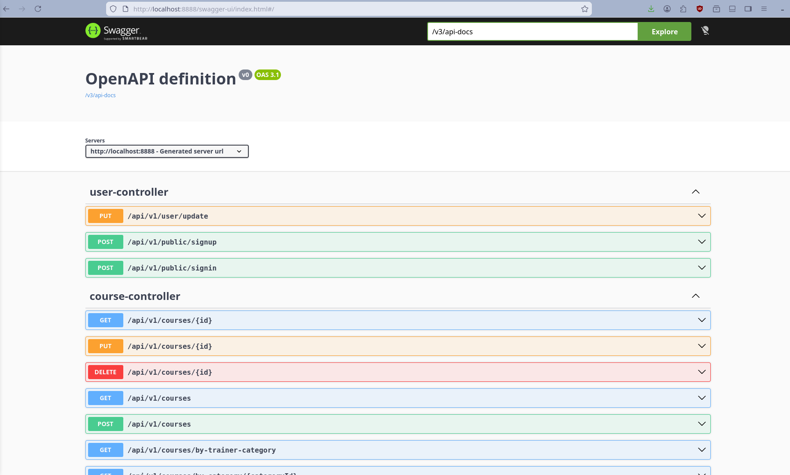

# Capstone Project – Backend README

## 📌 Overview  
This repository contains the backend service for my capstone project: a robust, scalable Java Spring Boot application that powers a micro-learning platform. It exposes RESTful APIs for managing courses, modules, user progress, and file uploads, with secure authentication and database persistence using MariaDB.

---

## 🛠️ Tech Stack

- **Language**: Java 17+  
- **Framework**: Spring Boot 3.5+  
- **Build Tool**: Maven  
- **Database**: MariaDB 10.6+  
- **ORM**: Spring Data JPA (Hibernate)  
- **Authentication**: Spring Security + JWT  
- **Validation**: Bean Validation (Jakarta Validation)  
- **Dev Tools**: Spring Boot DevTools, Lombok  
- **Testing**: Postman  
- **Deployment**: Docker + Docker Compose  

---

## 📦 Core Features

- ✅ RESTful API endpoints for CRUD operations (Courses, Modules, Users, etc.)  
- ✅ JWT-based stateless authentication & role-based authorization  
- ✅ Secure password hashing with BCrypt  
- ✅ Input validation & global exception handling  
- ✅ File upload support (e.g., course assets) with size limits  
- ✅ Database schema managed via `ddl-auto=update` (development) or Flyway (production-ready)  
- ✅ Environment-specific configuration using `.env` files  
- ✅ Live-reload during development  
- ✅ Comprehensive logging (DEBUG level in dev)

---

## 🚀 Getting Started

### Prerequisites
- Java 17+ (OpenJDK recommended)
- Maven 3.8+
- MariaDB server (local or Docker)
- Git

### Installation

1. **Clone the repository**
   ```bash
   git clone https://github.com/b00nw33/microedge_backend.git
   cd microedge_backend
   ```

2. **Set up environment variables**  
   Create a `.env` file in the project root:
   ```properties
   SERVER_PORT=8888
   DB_HOST=localhost
   DB_PORT=3306
   DB_NAME=microedge
   DB_USERNAME=your_db_user
   DB_USER_PASSWORD=your_db_password
   JWT_SECRET=your_strong_jwt_secret_here
   ```

3. **Build the project**
   ```bash
   mvn clean install
   ```

4. **Start MariaDB** (if not already running)  
   Example using Docker:
   ```bash
   docker run -d --name mariadb-capstone \
     -e MYSQL_ROOT_PASSWORD=rootpass \
     -e MYSQL_DATABASE=microedge \
     -e MYSQL_USER=your_db_user \
     -e MYSQL_PASSWORD=your_db_password \
     -p 3306:3306 \
     mariadb:10.6
   ```

5. **Run the application**
   ```bash
   mvn spring-boot:run
   ```
   The app will start on `http://localhost:8888`.

---

## 🐳 Docker Support

A `Dockerfile` and `docker-compose.yml` are included for containerized deployment.

Build and run:
```bash
docker-compose up --build
```

This starts both the Spring Boot app and a MariaDB container with proper networking and volume persistence.

---

## 📂 Project Structure

```
src/
├── main/
│   ├── java/com/microedge/
│   │   ├── config/            # Security, JWT, DB config
│   │   ├── controller/        # REST controllers
│   │   ├── services/          # Business logic
│   │   ├── repositories/      # JPA repositories
│   │   ├── models/            # JPA entities
│   │   ├── dto/               # Data Transfer Objects
│   │   ├── exceptions/        # Custom exceptions & handlers
│   │   └── MicroedgeApplication.java
│   └── resources/
│       ├── application.properties   # Main config
│       ├── .env                     # (gitignored) loaded via spring.config.import
│       └── data/                    # Optional SQL init scripts
└── test/
    └── java/com/microedge/          # Unit & integration tests
```

---

## Entity-Relationship Diagram (ERD)

https://dbdocs.io/pss.mrteo/Microedge?view=relationships




---

## 🔒 Security & Best Practices

- Sensitive credentials are loaded from `.env` (excluded from Git via `.gitignore`)
- Passwords are hashed using BCrypt
- CORS is configured restrictively
- SQL injection prevented via JPA parameterized queries
- Production deployments should disable `ddl-auto=update` and use migration tools (e.g., Flyway)

---

## 📬 API Endpoints (Examples)

| Endpoint               | Method | Description                     |
|------------------------|--------|---------------------------------|
| `/api/v1/public/signup`   | POST   | Register new user               |
| `/api/v1/public/signin`      | POST   | Login & receive JWT             |
| `/api/v1/courses`         | GET    | Get all courses (authenticated) |
| `/api/v1/courses/{courseid}`    | GET    | Get course by ID                |
| `/api/v1/courses/{courseid}/modules`         | POST   | Create new module               |

> Full API documentation generated using SpringDoc OpenAPI (Swagger)



---

## 📅 Future Enhancements

- Add email verification & password reset
- Implement caching with Redis
- Integrate with cloud storage (e.g., AWS S3) for file uploads
- Add rate limiting and audit logging
- Migrate to Flyway/Liquibase for production-grade DB migrations

---

## 🙋‍♂️ Contact

For collaboration or questions:  
👤 **Teo Boon Wee**  
📧 gyrowcode@gmail.com  
📱 +65 8824 6838  
🔗 [GitHub](https://github.com/b00nw33)  

---

> **Capstone Backend – Micro-Learning Platform**  
> © 2026 Boon Wee. All rights reserved.  
> Built with Spring Boot, MariaDB, and passion 💻✨

## Others
[Boilerplates and Wireframes](https://fsd07.pages.dev)
[Frontend repo](https://github.com/alvingan-cmyk/FSD07-team1-capstone)
